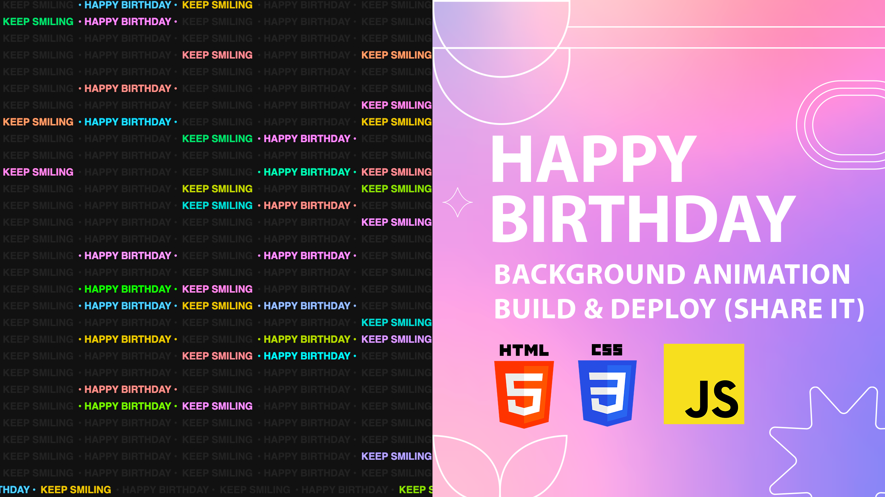

# Happy Birthday Animation Using HTML CSS JavaScript | Build and Deploy, Share Link with your friend

The Happy Birthday Background Animation, created with HTML, CSS, and JavaScript, brings a festive and celebratory atmosphere to a web page. Utilizing HTML for structure, CSS for styling, and JavaScript for animation control, this effect likely includes dynamic elements such as balloons, confetti, or other celebratory graphics that animate in the background. The animation adds a cheerful touch to the webpage, creating an interactive and joyful experience. It is a delightful way to celebrate birthdays or special occasions on a website, spreading happiness and engaging visitors in a festive atmosphere.

